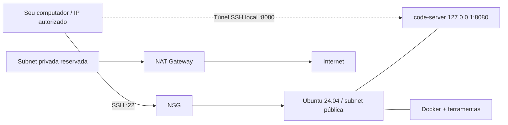

# Ambiente de desenvolvimento na Azure com Terraform

Infraestrutura como código para criar uma VM Ubuntu 24.04 LTS com Docker, Node.js 24, Python, Go, Terraform, Azure CLI e code-server.

O projeto demonstra provisionamento modular, configuração automatizada e testes de infraestrutura sem credenciais de nuvem. É um **laboratório de desenvolvimento**, não uma plataforma pronta para produção.

## Arquitetura



- Módulo **networking**: VNet, duas subnets, NSG, NAT Gateway e IP de saída.
- Módulo **compute**: IP público, interface de rede, VM e bootstrap.
- Apenas a porta SSH possui regra de entrada explícita, limitada ao CIDR informado.
- O editor escuta em loopback e usa autenticação por senha, acessível através do túnel.
- A subnet privada está reservada para expansão. O NAT Gateway continua gerando cobrança mesmo sem workloads nela; não é necessário para o editor na VM pública.

## Pré-requisitos

- Terraform **1.7+ e inferior a 2.0** (testado com 1.14.7).
- Azure CLI autenticada e assinatura com permissões para os recursos.
- Cliente OpenSSH e par de chaves RSA de pelo menos 2048 bits.
- Bash e PowerShell para executar a suíte de bootstrap; Make é opcional.

## Criar o ambiente

```bash
git clone https://github.com/Franciscoafcj/terraform-azure-dev-environment.git
cd terraform-azure-dev-environment
cp terraform.tfvars.example terraform.tfvars
ssh-keygen -t rsa -b 4096 -f ~/.ssh/azure-dev
az login
```

No PowerShell, use `Copy-Item terraform.tfvars.example terraform.tfvars`.
Edite os valores de `subscription_id`, `allowed_ssh_cidr`, identidade Git e `public_key_path`.
Use seu IP público seguido de `/32`; o projeto aceita apenas IPv4 entre `/24` e `/32`.
Selecione a mesma assinatura no Azure CLI:

```bash
az account set --subscription SEU_SUBSCRIPTION_ID
terraform init
terraform fmt -check -recursive
terraform validate
terraform plan -out=dev.tfplan
terraform apply dev.tfplan
```

Leia o plano antes de aplicar: estes comandos criam recursos cobrados na Azure.
O arquivo de plano e o estado podem conter dados sensíveis; mantenha-os fora do Git.
A chave privada fica exclusivamente no seu computador.

## Acessar o editor

Consulte o IP e o comando de túnel:

```bash
terraform output vm_public_ip
terraform output vscode_tunnel_command
```

Se usou uma chave específica, acrescente `-i ~/.ssh/azure-dev`:

```bash
ssh -i ~/.ssh/azure-dev -N -o ExitOnForwardFailure=yes -L 127.0.0.1:8080:127.0.0.1:8080 azuredev@IP_DA_VM
```

Mantenha esse terminal aberto. No navegador, acesse **http://127.0.0.1:8080**.
Para obter a senha, abra outra sessão SSH e execute:

```bash
cat ~/.config/code-server/config.yaml
```

A senha é gerada na VM, protegida com modo `600` e não é escrita deliberadamente nos logs de provisionamento.
Os outputs SSH usam o agente/configuração padrão; informe `-i` quando necessário.
Para uma aplicação na porta 3000, adicione outro encaminhamento local:
`-L 127.0.0.1:3000:127.0.0.1:3000`.

## Verificar a instalação na VM

O sucesso do Terraform **não significa que o bootstrap terminou**. Após conectar:

```bash
sudo cloud-init status --wait
sudo tail -n 100 /var/log/user-data.log
systemctl is-active docker
systemctl is-active code-server@$USER
docker compose version
node --version
python3 --version
go version
terraform version
az version
curl -I http://127.0.0.1:8080
```

Faça um novo login antes de usar Docker sem `sudo`, para carregar o grupo atualizado.
O grupo Docker concede privilégios equivalentes a root.

## Testes sem Azure

```bash
terraform init -backend=false
terraform fmt -check -recursive
terraform validate
terraform test
pwsh -File tests/bootstrap.Tests.ps1
```

No Windows, execute o último teste no PowerShell e informe o Bash do Git:
```powershell
./tests/bootstrap.Tests.ps1 -Bash "C:/Program Files/Git/bin/bash.exe"
```

A suíte usa o provider AzureRM **mockado**, sem criar recursos ou exigir login:

| Verificação | Objetivo |
| --- | --- |
| Plano do módulo raiz | URL local do editor |
| CIDRs inválidos, wildcard e acesso global | Rejeitar configuração de acesso inadequada |
| Disco e usuário inválidos | Falhar antes do provisionamento |
| NSG | Manter apenas SSH como entrada explicitamente liberada |
| Bootstrap da VM | Senha SSH desabilitada, editor local e permissões restritas |
| Script renderizado | Sintaxe Bash e identidade Git com aspas e comandos tratados como texto |

A chave pública em `tests/fixtures/test.pub` é exclusivamente uma fixture de teste.
A suíte não instala pacotes nem comprova quotas, disponibilidade de SKU, permissões da assinatura ou instalação real na VM.
O workflow de CI executa essas mesmas verificações com permissão somente de leitura.

## Configuração

| Variável | Padrão / requisito |
| --- | --- |
| `subscription_id` | Obrigatória |
| `allowed_ssh_cidr` | Obrigatória; IPv4 /24 a /32; prefira /32 |
| `location` | `eastus` |
| `project_name` / `environment` | `dev-environment` / `dev` |
| `vm_size` | `Standard_B2s` (imagem x86-64) |
| `disk_size_gb` | 30 GiB; inteiro entre 30 e 4095 |
| `admin_username` | `azuredev` |
| `public_key_path` | `~/.ssh/id_rsa.pub`; suporta expansão de ~ |
| `git_user_name` / `git_user_email` | Identidade Git configurada no usuário da VM |
| `vnet_address_space` | `10.0.0.0/16` |
| `public_subnet_prefix` / `private_subnet_prefix` | `10.0.1.0/24` / `10.0.2.0/24` |

As subnets devem ser distintas, não sobrepostas e contidas na VNet; ajuste-as juntas.
Veja `variables.tf` para descrições completas. Go e Python vêm dos repositórios do Ubuntu.
O lockfile fixa o provider. A imagem Ubuntu e alguns instaladores usam versões atualizadas upstream, portanto o ambiente ainda não é totalmente reproduzível.

## Custos, estado e remoção

Os custos incluem VM, disco Premium, IPs públicos, NAT Gateway e tráfego. Consulte a [calculadora Azure](https://azure.microsoft.com/pricing/calculator/) para sua região e assinatura. Parar a VM não remove cobranças de disco, IP e NAT.

```bash
terraform plan -destroy
terraform destroy
```

O Makefile preserva confirmação em `apply` e `destroy`. `make clean` remove apenas o cache `.terraform`, preservando estado e lockfile. **Não apague o estado para tentar remover recursos.**
O backend padrão é local: faça backup seguro do estado e configure um backend remoto com controle de acesso e locking antes de trabalhar em equipe.

## Atualização de ambientes existentes

Esta versão remove as regras públicas 8080, 3000, 8000 e 8443, exige CIDR explícito e muda o editor para túnel SSH.
Alterar `custom_data` pode substituir a VM; confira o plano e faça backup de arquivos da VM antes de aplicar.
O NSG mantém as regras padrão da Azure, incluindo comunicação na rede virtual; isto não implementa isolamento completo de produção.

## Estrutura

```text
main.tf / variables.tf / outputs.tf / versions.tf
modules/
  networking/                  # Rede e controle de acesso
  compute/
    scripts/user_data.sh       # Bootstrap renderizado pelo Terraform
tests/
  security.tftest.hcl           # Testes de planos com mocks
  bootstrap.Tests.ps1           # Renderização e sintaxe Bash
  fixtures/test.pub             # Chave pública de teste
.github/workflows/validate.yml  # CI sem credenciais Azure
```

## Decisões técnicas

- Túnel SSH evita publicar o editor via HTTP na internet.
- Identidade Git codificada em Base64 impede que aspas ou substituições de comando virem código shell.
- Docker Compose vem do pacote oficial já instalado, sem download duplicado.
- Estado e lockfile são preservados para rastrear recursos e repetir a seleção do provider.
- Instaladores externos e acesso privilegiado permanecem limitações de um laboratório; para produção, prefira imagens pré-construídas e verificadas.

Licença [MIT](LICENSE).
